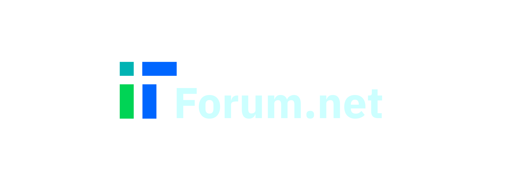

# Specyfikacja Projektu (SRS)

TODO: Informacja wstępna.

# Misja projektu

TODO: Wymyśleć coś.

# Krótki opis

Celem naszego projektu jest stworzenie forum internetowego, skupiającego się wokół tematu informatyki. Użytkownicy będą w stanie prowadzić dyskusje, tworzonych przez nich postach. Użytkownicy będą również mogli grupować posty według tagów. Aplikacja będzie w pełni internetowa. Każdy będzie mógł stworzyć swoje konto, wystarczy połączenie z Internetem.

# Cele
TODO: podzielić na klienta i biznesowe
* Reklama marki - dopisać konkrety
* Zachęcenie potencjalnych kandydatów do zatrudnienia się w naszej firmie - wynika z poprzedniego punktu
* Usprawnienie komunikacji pomiędzy użytkownikami - dopisać konkrety
* Zwiększenie liczby wykwalifikowanych specjalistów - dopisać konkrety
* Ułatwienie dostępu do informacji dzięki zaawansowanemu silnikowi do wyszukiwania postów na podstawie tagów - dopisać konkrety

# Wymagania funkcjonalne
## Tworzenie nowych kont
### User story
### Kryteria akceptacji
## Logowanie
### User story
### Kryteria akceptacji
## Dodawanie postów
### User story
### Kryteria akceptacji
## Dodawanie odpowiedzi do postów
### User story
### Kryteria akceptacji
## Przeglądanie postów
### User story
### Kryteria akceptacji
## Wyszukiwanie postów
### User story
### Kryteria akceptacji

# Atrybuty jakościowe

## Przystępność (accesibility)
## Bezpieczeństwo (security)
## Skalowalność (scalability)
## Łatwość w zarządzaniu (manageability)

# Ograniczenia w projekcie
## Technologiczne
## Organizacyjne
## Środowiskowe