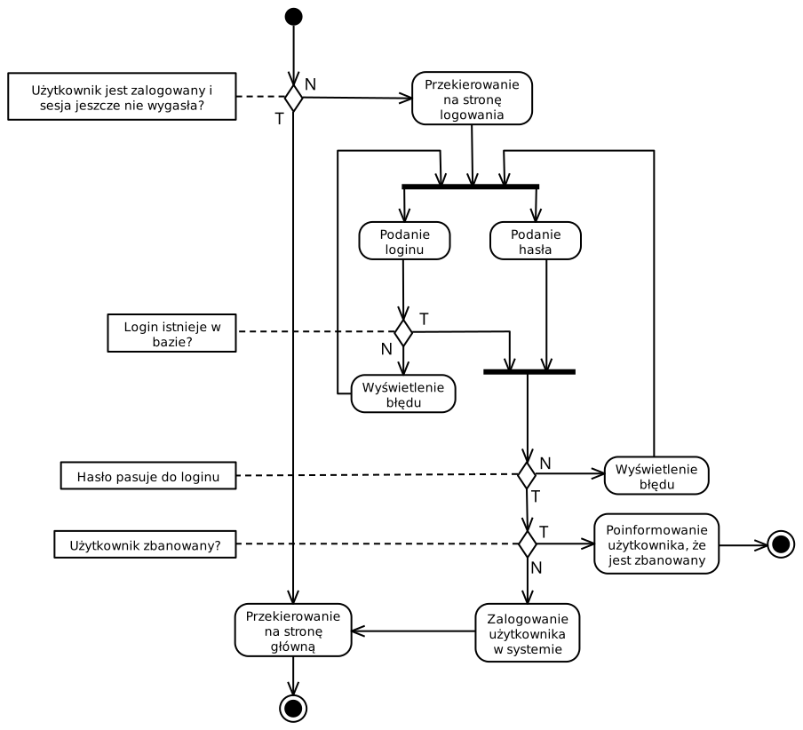
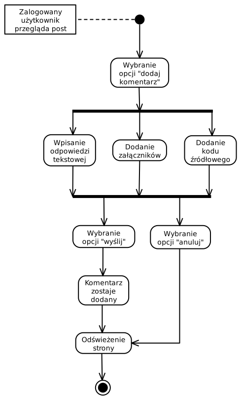

# Przypadki użycia

* Tworzenie nowych kont
* Logowanie
* Dodawanie postów
* Dodawanie odpowiedzi do postów
* Przeglądanie postów
* Wyszukiwanie postów
* Like'owanie postów
* Usuwanie postów przez moderatora
* Blokowanie konta przez moderatora
* Usuwanie konta

## Logowanie

## Dodawanie odpowiedzi do postów
